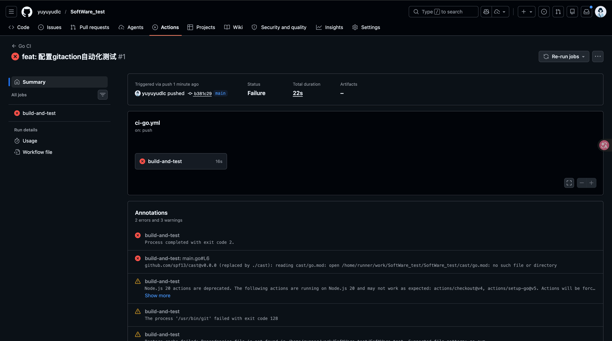
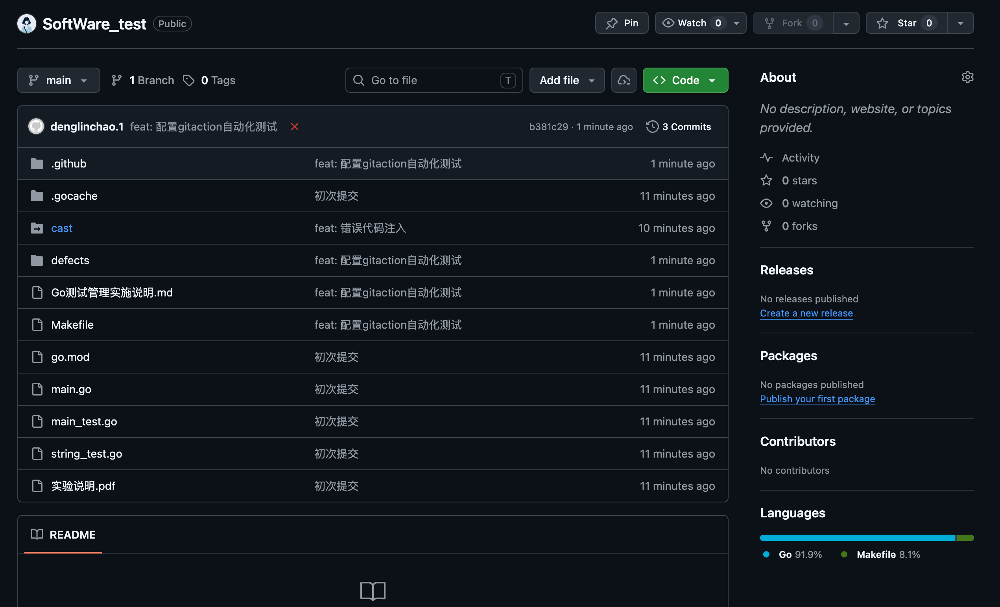

# Go 版本测试管理实施说明

## 1. 开发环境模块

本项目已采用以下模块化测试管理环境：

- Git 代码仓库：使用本地 Git 仓库（可同步到 GitHub/Gitee）
- 持续集成与测试：GitHub Actions（`.github/workflows/ci-go.yml`）自动执行 build/test
- Issue Tracking：使用 GitHub Issues，并通过 `.github/ISSUE_TEMPLATE/bug_report.yml` 规范缺陷提交

## 2. Go 项目配置（替代 Ant/Maven）

由于 Go 项目不生成 Jar，等价目标如下：

- `build`：导出完整可执行产物到 `dist/my-go-project`
- `test`：执行全量单元测试
- `test-smoke`：执行冒烟测试（关键用例子集）

对应配置在 `Makefile` 中：

- `make build`
- `make test`
- `make test-smoke`

## 3. 在持续集成中应用 test 任务进行冒烟测试

GitHub Actions 流程：

1. Checkout 代码
2. 执行 `make build`
3. 执行 `make test-smoke`
4. 执行 `make test`

在 GitHub Actions 日志中可以看到 `go test -v` 输出的测试用例执行日志，满足冒烟测试可追踪要求。

## 4. 缺陷提交流程与格式（Go 项目版）

建议的一般流程：

1. 发现缺陷并复现，确认稳定复现步骤
2. 在 Issue 工具中新建 Bug
3. 按模板填写关键信息：模块、环境、复现步骤、预期/实际、严重级别、日志
4. 指派处理人并设定优先级
5. 修复后关联提交与 PR，并在 CI 通过后关闭 Issue
6. 回归测试并记录结论

建议缺陷字段（最小集合）：

- 标题：`[BUG] 简短描述`
- 影响模块
- 环境信息（OS/Go 版本/分支/提交号）
- 复现步骤
- 预期结果
- 实际结果
- 严重级别
- 日志与截图

以上字段已在 `.github/ISSUE_TEMPLATE/bug_report.yml` 中落地，可直接用于课程实验提交。

## 5. 本次执行结果与缺陷登记

- 已执行：`make build`、`make test-smoke`
- 冒烟测试结果：发现 1 个缺陷（ToBoolE 对 "false" 解析异常）
- 已登记缺陷记录：`defects/BUG-20260421-001-ToBoolE-false.md`

该结果符合测试管理目标：通过 CI 冒烟测试尽早暴露关键缺陷，并进入规范化缺陷跟踪流程。

## 6. 实验截图

### 6.1 GitHub Actions 执行结果截图



说明：该图展示了 CI 流水线触发后任务执行失败的结果及错误注释信息。

### 6.2 仓库文件结构截图



说明：该图展示了仓库中的核心文件与目录，包含工作流、缺陷记录和报告文件。

## 7. 命令行日志（关键片段）

### 7.1 GitHub Actions 首次失败日志（子模块未拉取）

```text
go build -o dist/my-go-project .
Error: main.go:6:2: github.com/spf13/cast@v0.0.0 (replaced by ./cast): reading cast/go.mod: open /home/runner/work/SoftWare_test/SoftWare_test/cast/go.mod: no such file or directory
Process completed with exit code 2.
```

说明：该日志表明 CI 环境未获取到本地 `./cast` 目录内容，导致 build 失败。

### 7.2 修复配置后本地验证日志（测试本地 cast）

```text
$ test -f cast/go.mod && echo 'cast/go.mod ok'
cast/go.mod ok

$ make build
mkdir -p dist
go build -o dist/my-go-project .

$ make test-smoke
go test -v -run 'TestCastSuite|TestToStringE' ./...
=== RUN   TestCastSuite
=== RUN   TestCastSuite/ToBoolE/可以解析_false_字符串
	main_test.go:46: 得到 true，期望 false
--- FAIL: TestCastSuite (0.00s)
FAIL
make: *** [test-smoke] Error 1
```

说明：该日志证明当前已成功测试本地 `cast` 代码，并通过冒烟测试发现了 `ToBoolE("false")` 的缺陷。

