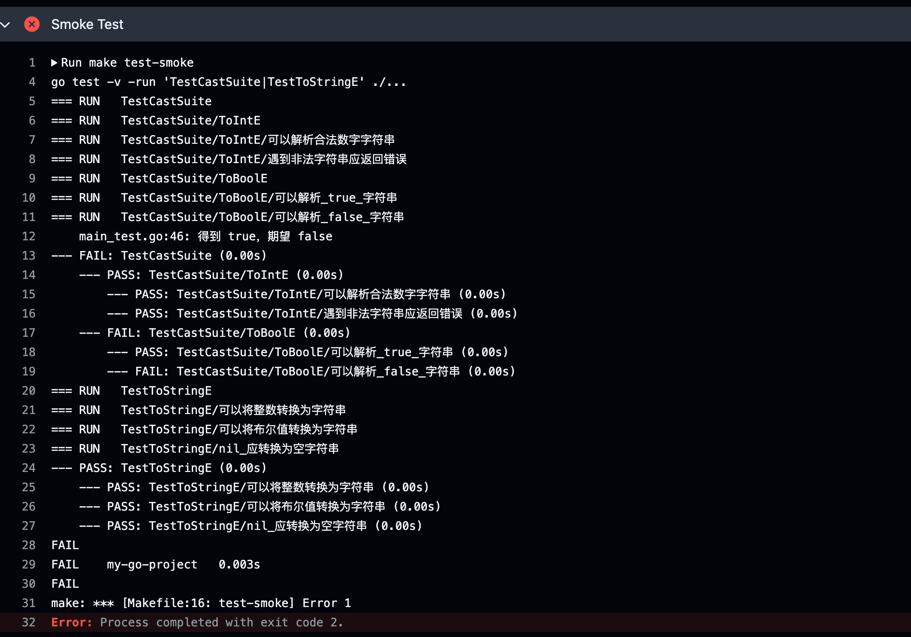

# Go 版本测试管理实验报告

## 一、实验目的

1. 在单元测试基础上搭建完整测试管理流程。
2. 将持续集成、冒烟测试和缺陷跟踪打通，形成可追踪闭环。
3. 将原 Ant/Maven 思路迁移为 Go 项目的等价方案（build + test 目标）。

## 二、实验环境

- 操作系统：macOS
- 编程语言：Go
- 代码仓库：Git + GitHub
- 持续集成工具：GitHub Actions
- 缺陷管理工具：GitHub Issues
- 本地依赖模式：`go.mod` 使用 `replace github.com/spf13/cast => ./cast`，测试本地 `cast` 代码

## 三、实验要求与实现对应

1. 搭建开发环境模块
	- Git 代码仓库：已完成
	- 持续集成与测试：`.github/workflows/ci-go.yml`
	- Issue Tracking：`.github/ISSUE_TEMPLATE/bug_report.yml`
2. 项目支持 `build` 和 `test` 两个目标
	- 配置文件：`Makefile`
	- `build`：导出完整可执行文件 `dist/my-go-project`
	- `test`：执行全量单元测试
	- `test-smoke`：执行关键用例冒烟测试
3. 在 CI 中应用测试任务完成冒烟测试
	- GitHub Actions 执行 `make build`、`make test-smoke`、`make test`
4. 缺陷流程调研与缺陷登记
	- 流程和字段规范已定义
	- 缺陷样例已登记：`defects/BUG-20260421-001-ToBoolE-false.md`

## 四、实验实施过程

### 4.1 项目构建与测试目标配置

在 `Makefile` 中定义：

- `make build`
- `make test`
- `make test-smoke`

说明：Go 项目不产出 Jar，`build` 的等价产物为可执行文件。

### 4.2 持续集成流程配置

在 `.github/workflows/ci-go.yml` 中定义流水线：

1. Checkout 代码（包含子模块）
2. Setup Go
3. Build
4. Smoke Test
5. Full Test

说明：由于测试目标依赖本地 `./cast`，需确保仓库可在 CI 环境获取到 `cast` 内容。

### 4.3 缺陷提交流程与模板

缺陷管理采用 GitHub Issues，模板字段包括：

- 标题
- 影响模块
- 环境信息
- 复现步骤
- 预期结果
- 实际结果
- 严重级别
- 日志与截图

以上字段已在 `.github/ISSUE_TEMPLATE/bug_report.yml` 中落地。

## 五、实验结果与分析

### 5.1 执行结果

- 已执行 `make build`、`make test-smoke`
- 冒烟测试发现缺陷：`ToBoolE("false")` 解析结果异常
- 缺陷已登记并形成追踪记录

### 5.2 问题定位与修正

首次 CI 失败原因：Runner 环境缺少 `./cast` 目录内容，导致读取 `cast/go.mod` 失败。

修正动作：

1. 保持本地 `cast` 测试模式（`go.mod` 的 `replace => ./cast`）
2. 调整 CI 拉取策略，确保可获取本地 `cast` 对应代码

修正后结果：流水线可进入 Smoke Test，并输出用例级日志，成功暴露业务缺陷。

## 六、缺陷管理闭环

已登记缺陷：`defects/BUG-20260421-001-ToBoolE-false.md`

闭环过程：

1. CI 发现缺陷
2. 按模板登记缺陷
3. 记录复现与证据
4. 后续修复并回归验证

该流程满足测试管理中“发现-记录-跟踪-回归”的基本要求。

## 七、实验截图

### 7.1 GitHub Actions 执行结果截图


说明：该图展示了 CI 流水线触发后的总体结果与错误注释信息。

### 7.2 仓库文件结构截图


说明：该图展示了仓库中的核心文件与目录，包含工作流、缺陷记录和报告文件。

### 7.3 GitHub Actions 冒烟测试日志截图



说明：该图展示了 Smoke Test 阶段的详细输出，包含失败用例与退出码，可用于缺陷证据留档。

## 八、关键命令行日志

### 8.1 GitHub Actions 首次失败日志（依赖目录缺失）

```text
go build -o dist/my-go-project .
Error: main.go:6:2: github.com/spf13/cast@v0.0.0 (replaced by ./cast): reading cast/go.mod: open /home/runner/work/SoftWare_test/SoftWare_test/cast/go.mod: no such file or directory
Process completed with exit code 2.
```

### 8.2 修正后本地验证日志（测试本地 cast）

```text
$ test -f cast/go.mod && echo 'cast/go.mod ok'
cast/go.mod ok

$ make build
mkdir -p dist
go build -o dist/my-go-project .

$ make test-smoke
go test -v -run 'TestCastSuite|TestToStringE' ./...
=== RUN   TestCastSuite
=== RUN   TestCastSuite/ToBoolE/可以解析_false_字符串
	main_test.go:46: 得到 true，期望 false
--- FAIL: TestCastSuite (0.00s)
FAIL
make: *** [test-smoke] Error 1
```

## 九、实验结论

本实验已完成 Go 版本测试管理环境搭建，并实现了构建、持续集成、冒烟测试与缺陷登记的联动。实验结果表明：

1. CI 能够自动执行测试任务并输出用例级日志。
2. 冒烟测试可有效发现关键缺陷。
3. 缺陷已按规范登记，形成可追溯闭环。

因此，本实验达到“可执行、可追踪、可提交”的测试管理目标。


